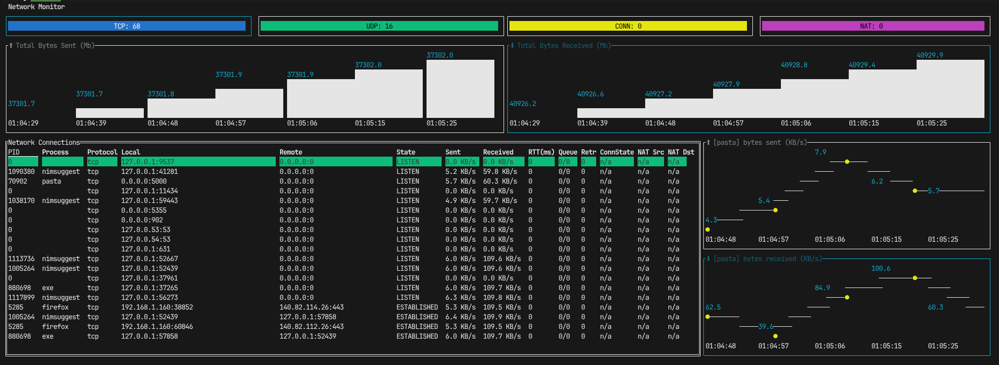

## nettui



A real-time terminal-based network monitoring tool built with Nim. Nettui provides comprehensive visibility into network connections, traffic statistics, and process-level network activity directly in your terminal.

**Only supported in Linux**

Features
- Real-time Network Monitoring: Live updates of network connections and statistics (1 sec interval)
- Process-Level Tracking: See which processes are using network resources
- Protocol Support: Monitor TCP, UDP, IPv4, and IPv6 connections
- Traffic Visualization: Charts for total bytes sent/received over time
- Connection Details: View connection states, RTT, queue sizes, and retransmit counts
- NAT and Conntrack Support: Monitor network address translation and connection tracking (requires appropriate permissions)
- Interactive Interface: Navigate and filter connections with keyboard controls

### Installation

**Prerequisites**

- Nim compiler (version 1.6+)
- Required Nim packages:
    - tui_widget - Terminal UI widget library
    - octolog - Logging library

Building from source

```shell
# Clone the repository
git clone https://github.com/jaar23/nettui.git
cd nettui

# Build the application
nimble build

# Run it
./nettui
```

How to navigate

- Tab to navigate between different widget
- In the network table view, type `/` to search and maintain in search view. Type `Esc` to exit the search view.


### Connection Table
Displays comprehensive information for each network connection:

|Column	|Description|
|---|---|
PID	|Process ID
Process	|Process name
Protocol	| Network protocol (TCP/UDP)
Local	|Local address and port
Remote |	Remote address and port
State	|Connection state
Sent/Received	Data | transfer rates
RTT	| Round-trip time
Queue	| Transmission/receive queue sizes
Retr	| Retransmission count
ConnState| 	Connection tracking state
NAT Src/NAT Dst | source/destination mappings
